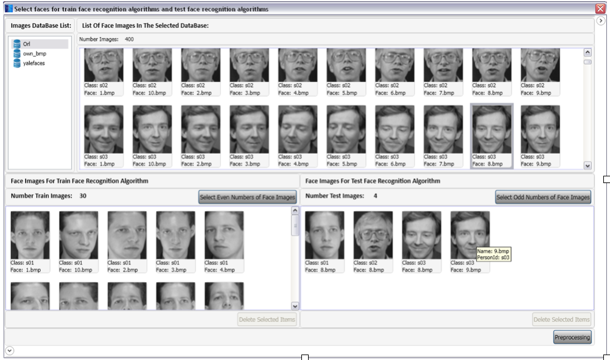

# Face Recognition Using Neural Networks

## Features
### Face Detection using Haar Cascade
### Recogniztion Methods:
    - EigenFace
    - One Layer BackPropagation
    - Two Layers BackPropagation
    - Three Layers BackPropagation
### Windows Application based on WPF
### Exports results to Excel

### Product Screens

-------------

-------------

-------------

-------------

-------------


## How to run:
    - Open FaceRecogntion directory
    - Run FaceRecognition.sln
    - Build project